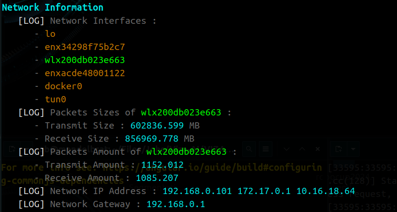

# Check-OS-Behaviour
Shell Script to Extract Operating System Related Information

## CPU Related
* Extract CPU’s Total Average Speed ( in MHz )
* Check Amount of Cores
* Check CPU Model
  <p align="center" style="position: relative;">
    
  </p>
  
  ⚠️ in ```Linux Performance Mode``` MacOS Core-i9 Processor Can Reach Speed Up to 4000 GHz, that is Why 2.3 GHz Processor Model has Average Frequency of >3GHz
## Memory Related
* Check Free Memory ( Check Live for 5 Seconds )
* Check Total Memory
  <p align="center" style="position: relative;">
    
  </p>
## Kernel Version and OS File System Related
* Maximum Amount of Files that Can be Opened
* Show Uptime of Operating System
* Maximum Size of Pipe Buffer
* Check Kernel Version
* OS Release
* OS Type
  <p align="center" style="position: relative;">
    
  </p>
## Network
* Show Network Interfaces Name
* Show Wireless Network Interfaces Name
* Show List of Available Network Protocols
* Show Amount of Received Packets of Online Network Interface
  <p align="center" style="position: relative;">
    
  </p>
## Show Input Devices of Bus
* Show List of Devices that are Connected to Your Operating System
<p align="center" style="position: relative;">
  
</p>
